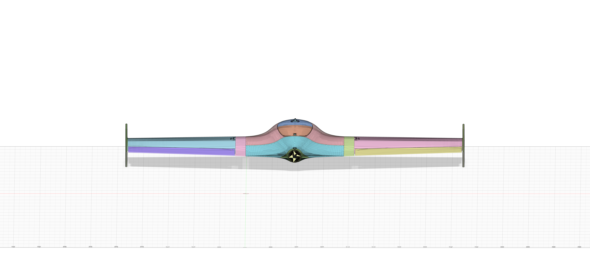
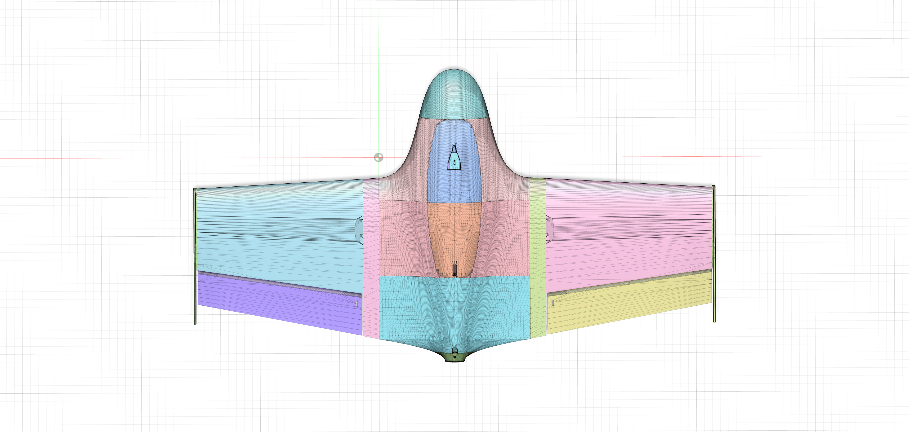
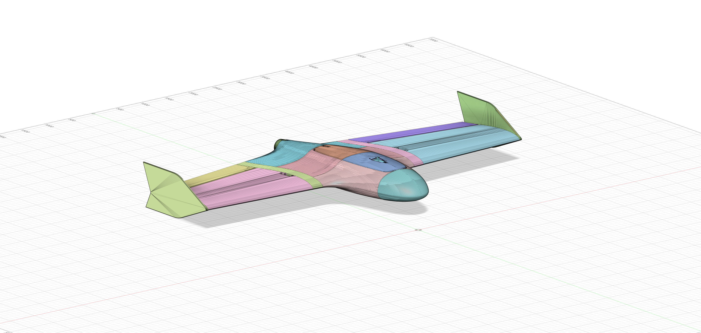

# UAV AI Radar Detection System

A fixed-wing UAV with onboard mmWave radar and AI for autonomous detection and classification of humans, vehicles, and drones in real time.

> **Status:** In Progress — Airframe design & electronics planning phase

---

## Overview

This project is a purpose-built unmanned aerial vehicle designed to carry an AI-powered radar detection system. The UAV is a simple carrier platform — the core of the project is the radar sensor and onboard AI pipeline that processes radar returns to detect, classify, and track targets below.

The system uses a TI IWR6843 60–64 GHz mmWave radar sensor, with all AI inference running onboard a Raspberry Pi 5. A future phase will add a VR operator interface via Meta Quest 3S for real-time 3D visualization and flight control.

---

## System Architecture

```
┌─────────────────────────────────────────────────┐
│                   UAV AIRFRAME                   │
│                                                  │
│  ┌──────┐  ┌──────────┐  ┌──────┐  ┌─────────┐ │
│  │ NOSE │  │  FUS_1   │  │FUS_2 │  │ FUS_3   │ │
│  │Radar │  │ FC+GPS   │  │Batt+ │  │ESC+BEC  │ │
│  │IWR6843│ │ +RX+Tele │  │ RPi5 │  │+Servos  │ │
│  └──────┘  └──────────┘  └──────┘  └─────────┘ │
│                                          MOTOR◄─┤
└─────────────────────────────────────────────────┘
                      │
                      ▼
┌─────────────────────────────────────────────────┐
│              AI PIPELINE (RPi 5)                 │
│                                                  │
│  Radar ADC → FFT → Range-Doppler Map → CFAR     │
│       → Ego-Motion Compensation (IMU+GPS)        │
│       → CNN Classifier (person/vehicle/drone)    │
│       → Kalman/JPDA Tracker → Threat Scorer      │
│       → WebSocket Output                         │
└─────────────────────────────────────────────────┘
                      │
                      ▼ (Phase 2)
┌─────────────────────────────────────────────────┐
│           VR INTERFACE (Quest 3S)                │
│                                                  │
│  3D Radar Scope │ Threat Panel │ Flight Commands │
└─────────────────────────────────────────────────┘
```

---

## Airframe

- **Type:** Fixed-wing pusher configuration
- **Material:** Bambu Lab PLA Aero (foaming LW-PLA, ~50% density of regular PLA)
- **Parts:** 20 3D-printed STL parts — 4-section fuselage, nose (clean + FPV variants), wings, ailerons, winglets, wing roots, hatches, firewall, locks
- **Dimensions:** ~371mm body length, ~420mm wingspan, ~76mm tall
- **Estimated frame mass:** ~180g
- **Target AUW:** ≤ 500g
- **CAD Software:** Fusion 360

- 
- 
- 

---

## Electronics Layout

| Location | Components | Est. Weight |
|----------|-----------|-------------|
| Nose | TI IWR6843ISK radar module | ~20g |
| FUS_1 | Flight controller + GPS + receiver + telemetry | ~45g |
| FUS_2 | 3S 1300mAh LiPo + Raspberry Pi 5 | ~135g |
| FUS_3 | ESC + BEC + servos | ~55g |
| Firewall | Pusher motor | ~30g |

**CG Target:** 160–190mm from nose tip (battery position in FUS_2 is the primary tuning variable)

---

## Radar Sensor

- **Sensor:** Texas Instruments IWR6843ISK
- **Frequency:** 60–64 GHz mmWave
- **Antenna:** 3TX / 4RX MIMO
- **FOV:** ~±60° azimuth
- **Detection range:** 5–10m for person-sized targets
- **Interface:** USB to Raspberry Pi 5

---

## AI Pipeline

The detection pipeline runs entirely onboard the Raspberry Pi 5:

1. **Signal Processing** — FFT to generate Range-Doppler maps from raw radar ADC data
2. **Detection** — CFAR (Constant False Alarm Rate) threshold detection
3. **Ego-Motion Compensation** — IMU + GPS data via MAVLink to subtract UAV movement from radar returns
4. **Classification** — CNN model classifying detections as person, vehicle, or drone
5. **Tracking** — Kalman filter with JPDA (Joint Probabilistic Data Association) for multi-target tracking
6. **Threat Scoring** — Priority ranking of tracked targets
7. **Output** — JSON track feed over WebSocket

**Training:** PyTorch (offline) → export to ONNX Runtime or TensorFlow Lite for onboard inference

---

## Software Stack

| Component | Technology |
|-----------|-----------|
| Flight firmware | PX4 |
| Ground station | QGroundControl |
| Radar SDK | TI mmWave SDK |
| Signal processing | Python, NumPy, SciPy |
| AI training | PyTorch |
| Onboard inference | ONNX Runtime / TensorFlow Lite |
| VR interface (Phase 2) | Unity 6, OpenXR, Meta Quest 3S |

---

## Project Phases

### Phase 1 — Airframe + Radar (Current)
- [x] Airframe CAD design in Fusion 360
- [x] Electronics selection and layout planning
- [ ] 3D print airframe with PLA Aero
- [ ] Assemble electronics and validate CG
- [ ] First flight test (manual RC)
- [ ] TI radar visualizer bring-up
- [ ] Python signal processing pipeline

### Phase 2 — AI + Tracking
- [ ] Collect radar training data
- [ ] Train CNN classifier in PyTorch
- [ ] Deploy inference model on RPi 5
- [ ] Implement Kalman/JPDA tracker
- [ ] Integrate with PX4 via MAVLink

### Phase 3 — VR Interface
- [ ] Unity 6 + OpenXR setup for Quest 3S
- [ ] WebSocket receiver for track feed
- [ ] 3D radar scope visualization
- [ ] MAVLink flight command interface

---

## Build Log

*Coming soon — will document assembly progress with photos*

---

## License

This project is for educational and research purposes.
